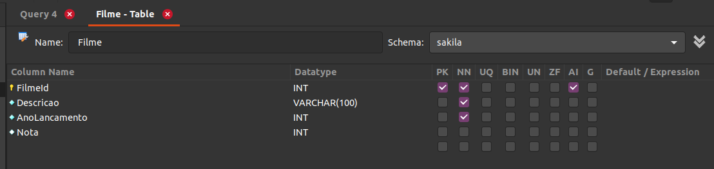

# **Bloco 20 -** Introdução à SQL

## DIA 1 - Banco de dados SQL

&nbsp;

### **Exercícios:** estes farão uso do banco `sakila`

1. Descubra como fazer uma pesquisa em qualquer tabela sem utilizar uma linha de código usando o **MySQL Workbench**
	* Clique com botão direito em uma tabela
	* Escolha a opção `Select Rows - Limit 100` (número sujeito a mudança ¬¬)

2. Descubra como é possível criar uma tabela sem usar código **SQL** usando o **MySQL Workbench**
	* Botão direito em `Tables`
	* Opção `Create Table` and kachow ;)

3. Crie uma tabela com as seguintes restrições:
	```
	Nome da tabela: Filme
	Colunas:
		- FilmeId: primary key, tipo int, incrementa por 1 cada vez que um valor é inserido automaticamente;
		- Descricao: não permite nulos, tipo texto (varchar(100));
		- AnoLancamento: não permite nulos, tipo int;
		- Nota: permite nulos, tipo int;
	```
	

4. Analise a tabela `city` e encontre a tabela à qual a coluna `country_id` faz referência
	* `country_id` faz referência à tabela `country` (duh)

5. Qual tipo de relacionamento a tabela `city` faz com a tabela `country`?
	* N:1 (várias cidades pra um mesmo país)

6. Qual tipo de relacionamento a tabela `country` faz com a tabela `city`?
	* 1:N (o contrário, obviamente - um país, várias cidades)

7. Analise as tabelas do banco sakila e encontre exemplos de um relacionamento **1:N** ou **N:1**
	* **1:N** language => film
	* **N:1** film => language
	* Um exemplo é o suficiente 🤭