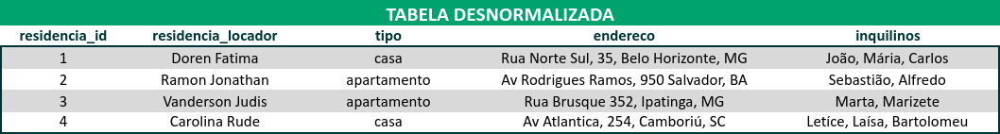
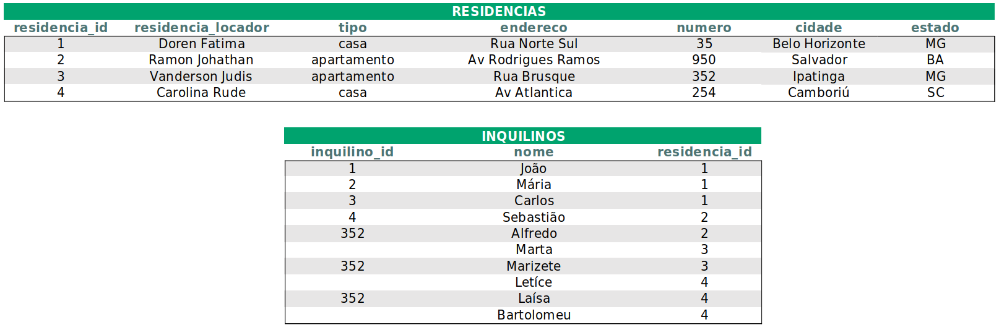
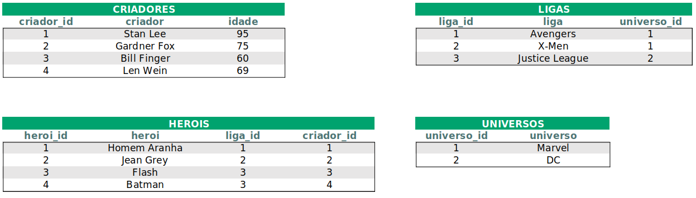

# **Bloco 21 -** Funções SQL, JOINs e Normalização

## DIA 3 - Transformando ideias em um modelo de banco de dados

&nbsp;

### **Exercícios sobre Normalização:**

2. Converta a seguinte tabela desnormalizada para a 1ª Forma Normal:

  	### **Resolução:**
	* Colunas devem possuir apenas um valor
	* Valores em uma coluna devem ser do mesmo tipo de dados
	* Cada coluna deve possuir um nome único
	* A ordem dos dados registrados em uma tabela não deve afetar a integridade dos dados

    

---
&nbsp;

3. Converta a seguinte tabela desnormalizada para a 2ª Forma Normal:

  	### **Resolução:**
	* A tabela deve estar na 1ª Forma Normal
	* A tabela não deve possuir dependências parciais
		
    

---
&nbsp;
