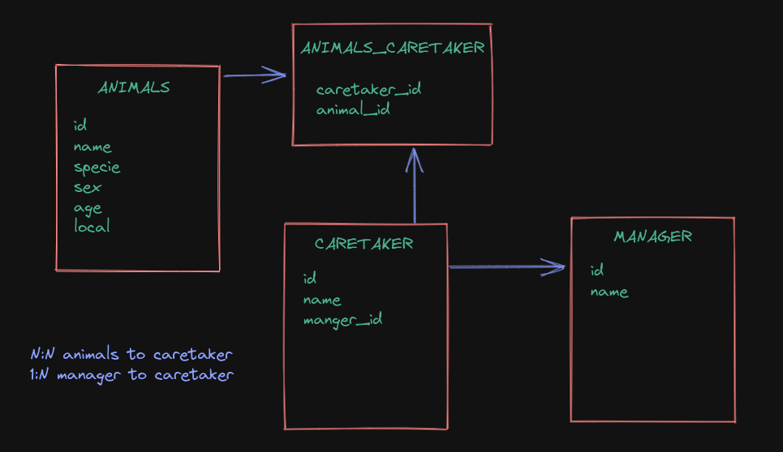

# **Bloco 21 -** Funções SQL, JOINs e Normalização

## DIA 3 - Transformando ideias em um modelo de banco de dados

&nbsp;

### **Exercícios:**

1. Um zoológico precisa de um banco de dados para armazenar as informações sobre os seus animais. Cada animal também possui **vários cuidadores**, e cada cuidador pode ser responsável por **mais de um animal**. Além disso, cada cuidador possui **um gerente**, sendo que cada gerente pode ser responsável por **mais de um cuidador**. As informações a serem armazanedas sobre cada animal são:
    * nome
    * espécie
    * sexo
    * idade
    * localização

    ```
    ENTIDADES
        * Animal
        * Cuidador
        * Gerente
        * Cuidador - Animal

    ATRIBUTOS
        * Animal: id, nome, especie, sexo, idade, localizacao
        * Cuidador: id, nome, gerente_id
        * Gerente: id, nome
        * Cuidador - Animal: cuidador_id, animal_id

    RELACIONAMENTOS:
        * 1 animal N cuidadores
        * 1 cuidador N animais
        * 1 gerente N cuidadores
        * 1 cuidador 1 gerente
    ```

    

    Código:
    ```sql
    DROP DATABASE IF EXISTS Zoo;
    CREATE DATABASE Zoo;
    USE Zoo;

    CREATE TABLE Animals(
    id INT AUTO_INCREMENT PRIMARY KEY,
    `name` VARCHAR(50) NOT NULL,
    specie VARCHAR(25) NOT NULL,
    sex VARCHAR(10) NOT NULL,
    age INT NOT NULL,
    `local` VARCHAR(100) NOT NULL
    -- this local one could be a foreign key 🤔
    );

    CREATE TABLE Managers(
    id INT AUTO_INCREMENT PRIMARY KEY,
    `name` VARCHAR(50) NOT NULL
    );

    CREATE TABLE Caretakers(
    id INT AUTO_INCREMENT PRIMARY KEY,
    `name` VARCHAR(50) NOT NULL,
    manager_id INT NOT NULL,
    FOREIGN KEY (manager_id) REFERENCES Managers(id)
    );

    CREATE TABLE Animal_Caretaker(
    animal_id INT,
    caretaker_id INT,
    CONSTRAINT PRIMARY KEY (animal_id, caretaker_id),
    FOREIGN KEY (animal_id) REFERENCES Animals(id),
    FOREIGN KEY (caretaker_id) REFERENCES Caretakers(id)
    );
    ```
